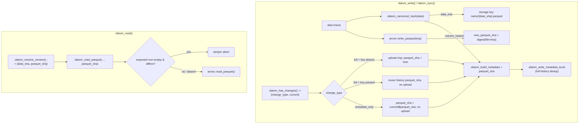

# datom-cv1 Canonical Hash & Three-SHA Identity — Design

Issue [#72](https://github.com/amashadihossein/datom/issues/72). This work **changes the
on-disk contract**: it redefines `data_sha` from "SHA of the parquet bytes" to "SHA of the
canonical logical content" (`datom-cv1`), adds the `parquet_sha` / `original_file_sha` /
`hash_algo` / `column_hashes` metadata fields, and wires the three-SHA identity model through
the sync, write, and read paths. Pre-release, so there is no migration path (see Rollout).

Companion #74 (merged) added `.datom_validate_sha()` and the read-time validation seam in
`.datom_read_parquet()`; Requirement 8 here extends that same function. Downstream #73's
`datom_diff` builds on the `column_hashes` index persisted here (Requirement 14).

## Read-first context

Line numbers drift; locate by function name. The current call chain, as read from source:

- `R/utils-sha.R`
  - `.datom_compute_data_sha(data, sort_columns, sort_rows)` — **today writes a temp parquet
    via `arrow::write_parquet()` and digests the file bytes.** This is exactly what
    `datom-cv1` replaces. The `sort_columns` / `sort_rows` params are removed (rev 7).
  - `.datom_compute_metadata_sha(metadata)` — excludes `volatile <- c("created_at",
    "datom_version")`, then `sorted_names <- sort(names(semantic))` (default = locale
    collation; the A-bis bug), hashes `jsonlite::toJSON(..., auto_unbox = TRUE)` with
    `serialize = FALSE`. **Never hashes the R object directly** (JSON canonical form is
    load-bearing — see engineering notes).
  - `.datom_compute_file_sha(path)` — SHA-256 of raw file bytes; the source of
    `original_file_sha`. Its name contains the bare token `file_sha` (Requirement 4 rename).
  - `.datom_sync_metadata(conn, name)` — a **second caller** of `.datom_has_changes()`
    (`change_type <- .datom_has_changes(...)`, compares `== "none"`). Must be updated when
    `.datom_has_changes()` changes its return shape.
- `R/read_write.R`
  - `datom_read()` → `.datom_read_metadata()` → `.datom_resolve_version()` →
    `.datom_read_parquet()`. This is the **only** call site of both `.datom_resolve_version()`
    and `.datom_read_parquet()` in `R/` (the rest of the `resolve_version` grep hits are
    tests). See the "both call sites" note in Open Questions.
  - `.datom_resolve_version(metadata_list, version, name)` — returns a bare `data_sha`
    string today; both the NULL-version (current) and the history-lookup branches return a
    string. Extended to return a list `{data_sha, parquet_sha}`.
  - `.datom_read_parquet(conn, name, data_sha)` — validates `data_sha` via
    `.datom_validate_sha()` (added by #74), downloads to a temp file, calls
    `arrow::read_parquet()`. The read-time integrity check inserts before the parse.
  - `.datom_build_metadata(data, data_sha, custom, table_type, size_bytes, parents,
    source_lineage)` — **lives here, not in `utils-sha.R`** (task brief said utils-sha; it is
    in read_write.R). Builds the metadata list. Gains `hash_algo`, `parquet_sha`,
    `original_file_sha`, `column_hashes`.
  - `.datom_has_changes(conn, name, new_data_sha, new_metadata_sha)` — reads `current`
    metadata, computes its `metadata_sha`, returns a bare string `"none"` / `"metadata_only"`
    / `"full"`. Refactored to return `list(change_type, current)` so `datom_write()` reuses
    the already-read `current` for the metadata_only carry-forward and the revert-to-older
    history scan (no second GET).
  - `.datom_write_metadata_local(conn, name, metadata, metadata_sha, message,
    original_file_sha)` — writes `metadata.json`, appends `version_history.json`. **Current
    dedup guard only checks `history[[1]]$version`** (latest only). Requirement 12 needs a
    full-history scan.
  - `datom_write()` — the orchestrator. Current order: (0) ref guard, (1)
    `.datom_compute_data_sha(data)`, (2) write temp parquet + `size_bytes`, (3)
    `.datom_build_metadata()` + `.datom_compute_metadata_sha()`, (4) `.datom_has_changes()`,
    (5) `.datom_write_metadata_local()`, (5b) `.datom_update_manifest_entry()`, (6) git
    commit/push, (7) upload parquet **only when `change_type == "full"`**, (8) push metadata
    S3, (9) push manifest S3.
- `R/sync.R`
  - `datom_sync_manifest()` — scans flat `input_files/`, computes `file_sha` via
    `.datom_compute_file_sha()`, builds a data frame with columns `name, file, format,
    file_sha, status` where status is `new`/`changed`/`unchanged`. Bare `file_sha` token
    (Requirement 4 rename) and the allowlist pre-flag point (Requirement 13.3).
  - `datom_sync()` — requires columns `c("name","file","format","file_sha","status")`,
    filters actionable `status %in% c("new","changed")`, imports via `.datom_import_file()`,
    computes `tbl_data_sha <- .datom_compute_data_sha(data)` for the self-lineage entry
    (**the `version_sha` self-entry bootstrap** — see engineering notes; must stay
    `data_sha`, not `metadata_sha`), then calls `datom_write(.table_type = "imported",
    .original_file_sha = tbl_file_sha, ...)`.
  - `.datom_import_file(file, format)` — parquet via `arrow::read_parquet()`, everything else
    via `rio::import()`. The allowlist gate (Requirement 13.2) goes at the top.
  - `.datom_update_manifest_entry(conn, name, metadata_sha, data_sha, file_sha, format)` —
    bare `file_sha` param (Requirement 4 rename); persists `entry$original_file_sha` (already
    correct on disk).
- `R/query.R` — `datom_get_lineage()` opens `{table}/.metadata/{version}.json` directly; it
  does **not** go through `.datom_resolve_version()` / `.datom_read_parquet()`, so it is
  untouched by Requirement 8. **But** `.datom_status_input_files()` (~line 521) calls
  `.datom_compute_file_sha()` and assigns a local `file_sha` var (compared to
  `existing$original_file_sha`), so it **is** in the Requirement 4 rename sweep.
- `R/utils-validate.R` — `.datom_validate_sha(x, arg)` (6–64 lowercase hex). Do **not** add
  it to `.datom_resolve_version()` (short prefixes are intentional — engineering note).
- `R/utils-storage.R` — `.datom_storage_exists(conn, key)` dispatches `s3`/`local`; this is
  the "object already exists at key" check for the revert-to-older-content branch.
  `.datom_storage_download()` / `.datom_storage_upload()` are the byte movers.

New files: `R/hashable.R` (exported `datom_check_hashable()` + internal
`.datom_hash_recourse()`), and `dev/datom_cv1_reference.R` (does not exist yet — the
executable reference spec).

## Overview

Three SHAs, three questions, three lifetimes:

| SHA | Question | Scope / stability | Where computed | Storage address? |
|-----|----------|-------------------|----------------|------------------|
| `original_file_sha` | "Has this input file changed?" | Raw bytes; language-independent; imported path only | `.datom_compute_original_file_sha()` in `datom_sync_manifest()` | Never |
| `data_sha` | "Is this the same content?" | Canonical logical content via `datom-cv1`; reproducible in R + renv | `.datom_canonical_hash()` (I/O-free) | **Yes — the only address** |
| `parquet_sha` | "Is the stored object intact?" | Exact stored parquet bytes; tied to arrow version | `digest(file = tmp)` in `datom_write()` | Never |

The central change: `data_sha` stops being a function of the serialized parquet bytes (which
vary with the arrow version and the R container class) and becomes a function of the in-memory
logical values only. Two tables with equal values hash equally regardless of tibble-vs-
data.frame, grouping, row names, or the installed arrow version. `parquet_sha` absorbs the
byte-level integrity role that the old `data_sha` accidentally conflated with identity.

## Architecture



`datom-cv1` sits at the root: it is a pure function of the data frame's in-memory values,
invoked before any git or storage mutation, so a refusal (unhashable column) leaves no partial
state. Everything downstream — addressing, change detection, the column index — consumes its
output.

## Components and Interfaces

### 1. `datom-cv1` canonical hash (Group A)

New engine in `R/utils-sha.R`:

```r
.datom_canonical_hash(data) -> list(data_sha = <hex>, column_hashes = list(list(name=, sha=), ...))
```

Contract (Requirements 1, 2, 3):

- **Guards**: abort unless `is.data.frame(data)`; abort when `nrow(data) == 0L ||
  ncol(data) == 0L`. Zero I/O — no parquet/CSV write, no temp files, no re-read. Reads columns
  via `data[[i]]`, names via `names(data)`, dims via `nrow()`/`ncol()`. **No `as.data.frame()`
  or any coercion helper** (a container-class-independent read is the whole point — a tibble,
  `grouped_df`, or plain data.frame with equal values must hash identically). Never invokes
  arrow.
- **Single classifier `.datom_column_kind(x)`** — the one place the supported-type
  classification lives. It returns the supported **kind** (the dispatch tag/branch: `"i64"`,
  `"chr"` for factor/character, `"date"`, `"time"`, `"drtn"`, the labelled fall-through, or
  `"num"`) or `NULL` when the column is unsupported. Both the gate and the encoder consume it,
  so the two dispatches can never drift (a column the gate passes but the encoder cannot handle
  is structurally impossible — the exact one-at-a-time failure Requirement 11.4 forbids). See
  Section 4 for how `.datom_hash_recourse()` and the encoder both bind to it.
- **All-offenders pre-scan** (Requirement 11): before encoding, map every column through
  `.datom_hash_recourse()` (which returns non-`NULL` exactly when `.datom_column_kind()` is
  `NULL`). If any are unsupported, abort **once** listing every offender (see Error Handling for
  the pinned message). This fires during `data_sha` computation — step 1 of `datom_write()` —
  before git/storage/manifest mutation.
- **Per-column type dispatch — `.datom_column_kind(x)` evaluated in this exact order**
  (Requirement 2.2); the encoder dispatches on the returned kind (and treats a "gate passed but
  `.datom_column_kind()` is `NULL`" case as an internal error that should be impossible):
  1. `bit64::integer64` → tag `"i64"`: copy the 8-byte bit patterns verbatim
     (`unclass()` to the underlying double storage, `writeBin(size = 8, endian = "little")`),
     **no** NaN/zero canonicalization (Requirement 2.5).
  2. factor → tag `"chr"`: encode `as.character(x)` via the character encoder; factor levels
     and orderedness are **not** identity (Requirement 2.6).
  3. `Date` (incl. integer-storage Dates and `data.table::IDate`) → tag `"date"`: numeric
     encoder over `as.double(unclass(x))` (Requirement 2.7).
  4. `POSIXct` → tag `"time"`: numeric encoder over `as.double(unclass(x))` (epoch seconds);
     `tzone` excluded (Requirement 2.8).
  5. `difftime` / `hms` → tag `"drtn"`: numeric encoder over the numeric payload, then `0x00`,
     then the required `units` string (`attr(x, "units")`) as UTF-8 (Requirement 2.9).
  6. `data.table::ITime` → tag `"drtn"`, encoded identically to `difftime` with units
     `"secs"`, so an `ITime` and an `hms` of the same clock times hash equal (Requirement 2.9).
  7. `haven_labelled` / `labelled` / `labelled_spss` → strip class and attributes and **fall
     through** to the underlying type's rule; labels are not identity (Requirement 2.10).
  8. any **other classed** column → refused (routes through `.datom_hash_recourse()`).
  9. unclassed atomics: logical / integer / double → tag `"num"` (unified numeric encoder);
     character → tag `"chr"` (character encoder).
  10. any **other type** → refused.
- **Shared numeric encoder** (Requirement 2.3, 2.13) — one function used by `num`, `date`,
  `time`, `drtn`:
  - Coerce to double, `writeBin(as.double(x), raw(), size = 8, endian = "little")` (IEEE-754
    little-endian, fixed regardless of host endianness).
  - Canonicalize every `NaN` payload to a single canonical `NaN` bit pattern (so `0/0` and a
    signalling NaN hash equal) — Requirement 16.1 `0/0 vs NaN equal`.
  - Convert `-0.0` to `+0.0` before writing — Requirement 16.1 `-0 vs 0 equal`.
  - Preserve `NA_real_` as a distinct bit pattern from `NaN` (R's `NA_real_` is a specific NaN
    payload; do not fold it into the canonical NaN) — Requirement 16.1 `NA_real_ vs NaN differ`.
- **Character encoder** (Requirement 2.4): a one-byte-per-row NA mask (`0x01` where `is.na`,
  `0x00` otherwise) followed by each value `enc2utf8()`-ed and NUL-terminated (`0x00`
  separator). NA and `""` are distinguishable (NA sets the mask byte; `""` is just a bare
  terminator). **No Unicode normalization** — NFC and NFD hash differently (documented benign
  limitation).
- **Per-column digest** (Requirement 2.1):
  `sha256( utf8(tag) || utf8(colname) || 0x00 || payload )` via
  `digest::digest(<raw vector>, algo = "sha256", serialize = FALSE)`. `colname` is
  `enc2utf8(names(data)[i])`. Assembled as a raw vector; `serialize = FALSE` throughout.
- **Final hash** (Requirement 2.11):
  `sha256( "datom-cv1" || f64le(nrow) || f64le(ncol) || concat(col_digest_hex ...) )` where
  `f64le` is the 8-byte little-endian double encoding of the dimension, and `col_digest_hex`
  are the per-column hex digests concatenated in column order.
- **No rounding, no sorting** (Requirement 2.12, 3): doubles are bit-exact; rows and columns
  are never sorted.
- **Return value**: `list(data_sha, column_hashes)` where `column_hashes` is an ordered list
  of `{name, sha}` — the per-column digests computed **once** and reused for both `data_sha`
  and the persisted index (Requirement 14.2).

`.datom_compute_data_sha(data)` becomes a thin wrapper — `.datom_canonical_hash(data)$data_sha`
— with the rev-7 signature `(data)` and **no** `sort_columns`/`sort_rows` params (Requirement
3.1). It preserves the scalar-string contract for the `datom_sync()` self-lineage caller
(`sync.R`), which needs only the `data_sha`. `datom_write()` calls `.datom_canonical_hash()`
directly to get both `data_sha` and `column_hashes` in one pass.

**Parity with the reference** (Requirement 15): `dev/datom_cv1_reference.R` is a standalone
base-R + `digest` reimplementation of the identical byte layout, with no sort args, pure ASCII
(Unicode fixtures built via `intToUtf8()`). Parity is guaranteed structurally: both
implementations serialize the same tag/name/payload byte sequences and call the same
`digest::digest(..., serialize = FALSE)` primitive, so identical inputs must produce identical
hex. The package test suite asserts equality across the full fixture set (skipped when `dev/`
is absent, e.g. on CRAN). The reference script prints golden constants that the tests also
hard-code; any drift on any CI environment fails a test.

### 2. Three-SHA wiring across write/read (Group B)

**`.datom_build_metadata()`** gains `hash_algo = "datom-cv1"`, `parquet_sha = NULL`,
`original_file_sha = NULL`, `column_hashes = NULL` (Requirement 5.1). Rules:

- `hash_algo` always present, `"datom-cv1"`.
- `column_hashes` present as an ordered array of `{name, sha}` (Requirement 14.1).
- `original_file_sha` included **only when non-NULL** — imported path sets it; derived path
  leaves it absent from the metadata entirely (not present-with-NULL) (Requirement 5.2).
- `parquet_sha` is declared but populated by `datom_write()` after change detection (it cannot
  be known until then; and it is excluded from `metadata_sha`, so ordering is safe).

**`datom_write()` revised order**:

1. ref guard (unchanged).
2. `hashed <- .datom_canonical_hash(data)` → `data_sha`, `column_hashes`. (All-offenders abort
   fires here, before any mutation — Requirement 11.3.)
3. write temp parquet; `size_bytes`; `new_parquet_sha <- digest::digest(file = tmp,
   algo = "sha256")` (Requirement 5.3).
4. `meta <- .datom_build_metadata(..., hash_algo, column_hashes, original_file_sha =
   .original_file_sha)`; `metadata_sha <- .datom_compute_metadata_sha(meta)` — stable because
   the volatile set excludes `parquet_sha` and `column_hashes`.
5. `chg <- .datom_has_changes(conn, name, data_sha, metadata_sha)` → `{change_type, current}`.
6. `if (change_type == "none")` → return no-op (Requirement 9.6 / S6).
7. **Determine `parquet_sha`** (Requirements 5.4–5.6):
   - `metadata_only` → `parquet_sha <- current$parquet_sha`; **skip upload** (bytes already
     stored).
   - `full` and **no** object at `name/{data_sha}.parquet` (`!.datom_storage_exists`) → upload
     `tmp`; `parquet_sha <- new_parquet_sha`.
   - `full` and object **already exists** (content reverted to an older version) → **do not
     overwrite**; scan `version_history` for the most recent entry whose `data_sha` equals this
     `data_sha` and carries a `parquet_sha`, and reuse it; only if none carries one (legacy)
     upload `tmp` and use `new_parquet_sha`.
8. `meta$parquet_sha <- parquet_sha` **before** `.datom_write_metadata_local()` so it persists
   in `metadata.json` and in the `version_history` entry (Requirement 5.7).
9. `.datom_write_metadata_local()` (full-history dedup, below); manifest update; git; the
   parquet upload from step 7 (only in the two upload branches); metadata + manifest S3 push.
   The parquet upload stays **after** the git push deliberately: git push is the serialization
   point, so a concurrent writer of the same content aborts at push (merge conflict) before it
   can reach upload, which keeps the `full` + key-exists check (step 7) from being a TOCTOU hole
   that could silently invalidate another writer's recorded `parquet_sha`. (See Invariants — this
   ordering is load-bearing.)

**`.datom_has_changes()`** returns `list(change_type = ..., current = ...)`. `current` is the
already-read current metadata (or `NULL` for a brand-new table → `change_type = "full"`,
`current = NULL`). The **second caller** `.datom_sync_metadata()` (`utils-sha.R`) is updated to
read `$change_type`.

**Nomenclature cleanup** (Requirement 4) — eliminate the bare `file_sha` token so
`grep -rn "file_sha" R/ man/ vignettes/` matches only `original_file_sha` / `parquet_sha`:

- `.datom_compute_file_sha()` → `.datom_compute_original_file_sha()`.
- `datom_sync_manifest()`: local `file_sha` → `original_file_sha`; the returned data-frame
  column `file_sha` → `original_file_sha`.
- `datom_sync()`: `required_cols` and `tbl_file_sha` updated to `original_file_sha`.
- `.datom_update_manifest_entry(..., file_sha = ...)` param → `original_file_sha`; the
  `datom_write()` call site updated (`original_file_sha = .original_file_sha`).
- `R/query.R` `.datom_status_input_files()` (verified ~line 521): the `.datom_compute_file_sha()`
  call becomes `.datom_compute_original_file_sha()`, and the local `file_sha` variable it assigns
  (compared against `existing$original_file_sha`) → `original_file_sha`. Without this the
  acceptance gate `grep -rn "file_sha" R/ man/ vignettes/` would fail on this design's own
  checklist. (`datom_get_lineage()` in the same file is still untouched — it opens
  `{version}.json` directly and has no `file_sha` token; only Requirement 8 leaves it alone, the
  rename touches `.datom_status_input_files()` here.)
- Roxygen regeneration: renaming `.datom_compute_file_sha()` →
  `.datom_compute_original_file_sha()` means the `man/dot-datom_compute_file_sha.Rd` page
  regenerates to `man/dot-datom_compute_original_file_sha.Rd` via `roxygen2` (`devtools::document()`),
  clearing the bare `file_sha` token from `man/` as well.
- The on-disk field is already `original_file_sha`; no stored-format churn from the rename.
- `parquet_sha` and `original_file_sha` are the only `*_sha` names that survive the grep;
  `file_sha` (bare) is never introduced (Requirement 4.2).

**Metadata-SHA field ordering (A-bis, Requirement 6)**: change `sort(names(semantic))` to
`sort(names(semantic), method = "radix")` (C-locale byte order). Deterministic under
`LC_COLLATE=C` and `en_US.UTF-8` alike.

**Volatile field set (Requirement 7)**: `volatile <- c("created_at", "datom_version",
"parquet_sha", "column_hashes")`. Excludes `parquet_sha` (arrow-version byte drift must not
re-enter identity) and `column_hashes` (a deterministic function of the same values that fix
`data_sha`). `original_file_sha` and `hash_algo` remain **in** the semantic set — a new source
file or a new algorithm legitimately makes a new version.

**Read-time integrity (Requirement 8)**:

- `.datom_resolve_version()` returns `list(data_sha, parquet_sha)` on **both** branches:
  NULL-version → `{current$data_sha, current$parquet_sha}`; history-lookup → the resolved
  entry's `{data_sha, parquet_sha}`. `parquet_sha` may be `NULL`/`""` for pre-cv1 entries.
- `.datom_read_parquet(conn, name, data_sha, parquet_sha = NULL)`: after
  `.datom_storage_download()` and before `arrow::read_parquet()`, when `parquet_sha` is
  non-empty compute `actual <- digest::digest(file = tmp, algo = "sha256")`; if
  `!identical(actual, parquet_sha)` abort with the tamper message (names table, key, both
  hashes). When `parquet_sha` is absent/empty (pre-cv1 metadata) skip silently and read
  succeeds (Requirement 8.4).
- `datom_read()` updated: `resolved <- .datom_resolve_version(...)`;
  `.datom_read_parquet(conn, name, resolved$data_sha, parquet_sha = resolved$parquet_sha)`.

### 3. Full-history dedup guard (Group C, Requirement 12)

In `.datom_write_metadata_local()`, replace the latest-only guard
(`identical(history[[1]]$version, metadata_sha)`) with a full-history scan that short-circuits:

```r
exists_already <- purrr::some(history, ~ identical(.x$version %||% "", metadata_sha))
if (!exists_already) history <- c(list(new_entry), history)
```

`purrr::some()` is O(history) with early exit (Requirement 12.4). When a matching `version`
exists anywhere, no entry is appended, but `metadata.json` (the current pointer) is still
written (Requirement 12.2). Guarantees `version_history.json` never holds two entries with the
same `version` (Requirement 12.3). This is the S4 regression fix: re-syncing an older-but-
content-matching file (same `metadata_sha`) does not create a duplicate that would make
`datom_read(version=)` ambiguous. The version_history entry continues to record
`original_file_sha` alongside the new `parquet_sha` (Requirement 5.7).

### 4. Table contract: `datom_check_hashable()` + shared recourse (Group C, Requirements 10, 11, 13)

New file `R/hashable.R`:

```r
datom_check_hashable(data)      # exported; invisibly returns a data frame
.datom_hash_recourse(x)         # internal; NULL if supported, else canonical recourse string
.datom_column_kind(x)           # internal; supported kind (tag/branch) or NULL if unsupported
```

- `.datom_column_kind(x)` is the **single classifier** underneath everything: it embodies the
  supported-type classification once (the Section 1 dispatch order) and returns the supported
  kind or `NULL`. `.datom_hash_recourse(x)` binds to it (`NULL` kind → look up the offender's
  canonical recourse string; non-`NULL` kind → return `NULL`), and the `.datom_canonical_hash()`
  per-column encoder binds to it too (dispatch on the returned kind). Because the gate and the
  encoder read the **same** classifier, they cannot diverge — there is no column the gate accepts
  that the encoder then cannot encode (the encoder treats a non-`NULL` gate result with a `NULL`
  kind as an internal error that must be impossible), closing the one-at-a-time failure mode
  Requirement 11.4 forbids.
- `.datom_hash_recourse(x)` is the **single source of truth for recourse strings**. It inspects
  one column value and returns `NULL` when `.datom_column_kind(x)` is non-`NULL` (hashable) or the
  canonical recourse string otherwise. Both `datom_check_hashable()` and the
  `.datom_canonical_hash()` all-offenders pre-scan call this one function — the checker's advice
  and the abort's advice can never drift (Requirement 10.4).
- `datom_check_hashable(data)` maps every column through `.datom_hash_recourse()` and returns
  (invisibly) a data frame with one row per column: `column`, `class` (collapsed
  `class(x)` string, or `typeof(x)` when unclassed), `status` (`"ok"`/`"unsupported"`),
  `recourse` (`NA` when ok; the canonical string otherwise) (Requirement 10.2). It prints a cli
  report: a single `✓` summary when clean, else one `✗` per offending column with its recourse
  (Requirement 10.3). Carries runnable examples requiring no network and no store (Requirement
  10.5). Listed in `_pkgdown.yml` reference (Requirement 10.1).

The recourse map (canonical strings — see Error Handling). Applying any listed recourse makes
the fixture column hashable (Requirement 11.5).

### 5. Ingestion allowlist (Group C, Requirement 13)

Named constant in `R/sync.R`:

```r
.datom_import_formats <- c("csv", "tsv", "txt", "psv", "parquet",
                           "sas7bdat", "xpt", "sav", "zsav", "por", "dta",
                           "xls", "xlsx")
```

- `.datom_import_file(file, format)`: `fmt <- tolower(format)`; if `!(fmt %in%
  .datom_import_formats)` → `cli::cli_abort()` with the pinned allowlist message (Error
  Handling). Otherwise dispatch as today (parquet → arrow; else `rio::import()`) (Requirement
  13.4).
- `datom_sync_manifest()`: when building rows, a file whose `tolower(format)` is not in the
  allowlist gets `status = "unsupported_format"` up front (Requirement 13.3), so a `.rds`/`.json`
  is flagged without blocking allowlisted siblings.
- `datom_sync()`: `unsupported_format` rows are not actionable (`status %in% c("new",
  "changed")` is false); they surface with `result = "error"` and the allowlist recourse in the
  `error` column, and processing continues with the rest of the batch (one bad file does not
  block).

### 6. Persisted column index (Group D, Requirement 14)

`meta$column_hashes` is the ordered `{name, sha}` array from `.datom_canonical_hash()`, written
verbatim into `metadata.json` in table column order (Requirement 14.1), with no truncation
(Requirement 14.2). Excluded from `metadata_sha` (Requirement 14.4, via the volatile set). The
self-check (Requirement 14.3): recomputing
`sha256("datom-cv1" || f64le(nrow) || f64le(ncol) || concat(column_hashes$sha ...))` from the
stored array plus dims reproduces the stored `data_sha`. A single-column change flips exactly
that column's entry (Requirement 14.5) — the basis for #73's `datom_diff`.

## Data Models

`metadata.json` (imported table shown; derived omits `original_file_sha`, `parents`,
`source_lineage` differ):

```jsonc
{
  "data_sha": "…",              // datom-cv1 canonical content hash (address)
  "hash_algo": "datom-cv1",     // NEW — provenance; in metadata_sha
  "parquet_sha": "…",           // NEW — stored-object integrity; EXCLUDED from metadata_sha
  "original_file_sha": "…",     // NEW — imported path only; absent on derived; in metadata_sha
  "table_type": "imported",
  "nrow": 100, "ncol": 8,
  "colnames": ["id", "…"],
  "column_hashes": [            // NEW — ordered to columns; EXCLUDED from metadata_sha
    {"name": "id",  "sha": "…"},
    {"name": "age", "sha": "…"}
  ],
  "size_bytes": 4096,
  "created_at": "…Z",           // volatile
  "datom_version": "0.1.0",     // volatile
  "source_lineage": [ … ],
  "custom": { … }
}
```

`version_history.json` entry — gains `parquet_sha`, keeps `original_file_sha`:

```jsonc
{
  "version": "<metadata_sha>",  // UNIQUE across the whole file (Requirement 12)
  "data_sha": "…",
  "parquet_sha": "…",           // NEW — enables revert-to-older reuse scan + audit
  "original_file_sha": "…",     // imported entries only
  "timestamp": "…Z", "author": "…", "commit_message": "…"
}
```

`.datom/manifest.json` per-table entry is unchanged on disk (`original_file_sha`,
`original_format`, `current_data_sha`, `current_version`, …); only the in-code variable/param
names lose the bare `file_sha` token.

**`metadata_sha` semantic set** (post-change): everything in `metadata.json` **except**
`created_at`, `datom_version`, `parquet_sha`, `column_hashes`; field names sorted by
`method = "radix"`; hashed as `jsonlite::toJSON(auto_unbox = TRUE)` with `serialize = FALSE`.

## Invariants / must-never

- `.datom_canonical_hash()` performs **zero I/O** and never calls `arrow`, `as.data.frame()`,
  or any coercion helper. `grep -rn "as.data.frame" R/utils-sha.R` returns nothing.
- `data_sha` is the **only** storage address (imported and derived alike); `parquet_sha` and
  `original_file_sha` never appear in any storage key.
- The numeric encoder is **one** function shared by `num`/`date`/`time`/`drtn`; NaN
  canonicalization and −0→+0 live there and nowhere else.
- The type-dispatch order is fixed (Requirement 2.2); reordering it can silently change hashes.
- `metadata_sha` **excludes** `parquet_sha` and `column_hashes` and **includes**
  `original_file_sha` and `hash_algo`.
- Refusing an unhashable column happens in step 1 of `datom_write()`, before any git/storage/
  manifest write — a refusal leaves no partial state, and it lists **all** offenders at once,
  never one at a time.
- `.datom_column_kind()` is the **single** supported-type classifier; the hash gate
  (`.datom_hash_recourse()`) and the per-column encoder both dispatch on it, so no column can be
  accepted by the gate yet rejected by the encoder (never fail one column at a time).
- `.datom_hash_recourse()` is the sole producer of recourse strings; the checker and the abort
  both call it.
- `version_history.json` never contains two entries with the same `version`.
- The parquet upload happens **after** the git push, never before. Git push is the serialization
  point: a concurrent writer of the same content aborts at push (merge conflict) before reaching
  upload, which prevents the `full` + key-exists check from becoming a TOCTOU hole that could
  silently invalidate another writer's recorded `parquet_sha`. This ordering is load-bearing and
  must never be refactored to upload-before-push.
- The `datom_sync()` self-lineage `version_sha` stays `data_sha`, not `metadata_sha` (existing
  bootstrap invariant — engineering notes).
- `.datom_compute_metadata_sha()` continues to hash the JSON canonical form, never the R object
  (existing invariant).
- No `sort_columns`/`sort_rows` anywhere: `grep -rn "sort_columns\|sort_rows" R/ tests/`
  returns nothing.

## Correctness Properties

*A property is a characteristic or behavior that should hold true across all valid executions
of a system — a formal statement about what the system should do. Properties bridge the
human-readable spec and machine-verifiable correctness. Each is universally quantified and
remains the specification of what must hold, mapped to the requirements it validates.*

**Validation approach (0.1.0):** these properties are validated by **deterministic `testthat`
tests over the named edge-case fixtures** (Requirement 16.1 enumerates the concrete deterministic
cases), consistent with the golden-constant philosophy and adding no new dependency — **not** by
a generator-driven property-based-testing harness. There is currently no PBT harness in the
suite. Each test is tagged with its feature name and property number (format:
`Feature: {feature}, Property {number}: {text}`). Genuine generator-based PBT is **deferred** as
a possible future enhancement (candidate for #73). See Testing Strategy for the fixture mapping.

Redundancy reflection was applied to the prework: the numeric-encoder facts (NaN canonicalization,
−0→+0, NA_real_≠NaN, bit-exactness) are consolidated into one property; column-reorder and
row-reorder into one order-significance property; the three temporal encodings into one; and the
column-index alignment / `data_sha`-recompute / single-column-change facts into one. Static/grep
checks (zero-I/O, no-sort-params, nomenclature) and one-shot goldens (NIST, printed constants,
ASCII) are covered under Testing Strategy, not as properties.

### Property 1: Container-class and attribute independence

*For any* valid data frame, `.datom_canonical_hash()` returns the same `data_sha` whether the
values are held in a tibble, a plain data.frame, a `grouped_df`, or a `class<-`-faked wrapper,
and regardless of data-frame-level attributes or row names.

**Validates: Requirements 1.4**

### Property 2: Determinism

*For any* valid data frame, computing `.datom_canonical_hash()` twice yields the identical
`data_sha`.

**Validates: Requirements 1.7**

### Property 3: Type-tag disambiguation

*For any* pair of columns that share a payload but differ in semantic type, the `data_sha`
differs: `"1"` (character) vs `1` (numeric) differ, and an all-`NA` logical column vs an
all-`NA` character column differ (the tag distinguishes them even when the values coincide).

**Validates: Requirements 2.2, 16.1**

### Property 4: Numeric encoding semantics

*For any* numeric column, the shared numeric encoder holds these equalities and inequalities:
`0/0` and `NaN` hash equal (NaN payloads canonicalized), `-0.0` and `+0.0` hash equal,
`NA_real_` and `NaN` hash **differently**, and two columns differing by one unit-in-the-last-
place hash differently (no rounding).

**Validates: Requirements 2.3, 2.12, 2.13, 16.1**

### Property 5: Character encoding semantics

*For any* character column, a variant containing `NA` differs from the otherwise-identical
variant containing `""` (NA and empty string are distinguishable), and a string in NFC form
differs from its NFD form (no Unicode normalization).

**Validates: Requirements 2.4**

### Property 6: integer64 verbatim encoding

*For any* `bit64::integer64` column, its 8-byte bit patterns are hashed verbatim with no
NaN/zero canonicalization, so distinct `integer64` values (including NaN-bit-space values) hash
distinctly.

**Validates: Requirements 2.5**

### Property 7: Factor levels and orderedness are not identity

*For any* factor column, adding unused levels or toggling orderedness while preserving the
`as.character` values does not change the `data_sha`.

**Validates: Requirements 2.6**

### Property 8: Temporal encoding semantics

*For any* temporal column: two `POSIXct` columns denoting the same instants but carrying
different `tzone` hash equal; two `difftime` columns with the same numeric payload but different
`units` (e.g. `"secs"` vs `"mins"`) hash differently; and a `data.table::ITime` and an `hms` of
the same clock times hash equal.

**Validates: Requirements 2.7, 2.8, 2.9**

### Property 9: Labelled columns strip to their base type

*For any* base column, wrapping it as `haven_labelled` / `labelled` / `labelled_spss` (adding
value labels and attributes) produces the same `data_sha` as the bare underlying column.

**Validates: Requirements 2.10**

### Property 10: Row and column order are significant

*For any* data frame with at least two distinct columns, permuting the columns changes the
`data_sha`; *for any* data frame with at least two distinct rows, permuting the rows changes the
`data_sha`.

**Validates: Requirements 3.2, 3.3**

### Property 11: Reference-implementation parity

*For every* fixture in the shared, finite fixture set, the package `.datom_canonical_hash()` and
the standalone `dev/datom_cv1_reference.R` `datom_canonical_hash()` produce the identical
`data_sha`. This is a **fixture-based parity test** enumerated over that shared fixture set (no
random generator, no iteration count).

**Validates: Requirements 15.1, 15.4, 2.1, 2.11**

### Property 12: Column index integrity

*For any* valid data frame, the persisted `column_hashes` array is ordered to `names(data)`,
each entry's `sha` equals the standalone per-column digest, recomputing
`sha256("datom-cv1" || f64le(nrow) || f64le(ncol) || concat(column_hashes$sha …))` reproduces
the stored `data_sha`, and changing exactly one column flips exactly that column's entry.

**Validates: Requirements 14.1, 14.2, 14.3, 14.5**

### Property 13: metadata_sha locale determinism

*For any* metadata list, `.datom_compute_metadata_sha()` returns the same hash under
`LC_COLLATE=C` and under `en_US.UTF-8` (radix field-name ordering). The test **skips if the
`en_US.UTF-8` locale is unavailable** (e.g. on Windows CI), so it never ships matrix-red.

**Validates: Requirements 6.1, 6.2**

### Property 14: metadata_sha volatile-field membership

*For any* metadata list, changing `parquet_sha` or `column_hashes` leaves `metadata_sha`
unchanged, while changing `original_file_sha` or `hash_algo` changes it.

**Validates: Requirements 7.1, 7.2, 7.3, 7.4, 14.4**

### Property 15: Table-contract recourse is single-sourced and complete

*For any* unsupported column class in the recourse map, `datom_check_hashable()` flags that
column AND `.datom_canonical_hash()` aborts with the **identical** canonical recourse string;
*for any* table containing several unsupported columns, exactly one abort is raised naming every
offender; and applying the stated recourse to any offending column makes it hashable.

**Validates: Requirements 10.4, 11.1, 11.2, 11.4, 11.5**

### Property 16: Ingestion allowlist enforcement

*For any* file format not in `.datom_import_formats`, `.datom_import_file()` aborts with the
canonical allowlist recourse; *for any* allowlisted extension, it dispatches to the expected
reader.

**Validates: Requirements 13.1, 13.2, 13.4**

### Property 17: Full-history version dedup

*For any* `version_history` and any new entry whose `version` (metadata_sha) already appears
anywhere in that history, `.datom_write_metadata_local()` does not grow the history and the
resulting file contains no two entries with the same `version`; the current pointer
(`metadata.json`) is still written.

**Validates: Requirements 12.1, 12.2, 12.3, 12.4**

## Error Handling

All user-facing strings below are **canonical**: this design is their single source of truth
(per Requirements 11, 13.2). Implementations must reproduce them verbatim; tests assert against
them. All strings are ASCII (`--` not em-dash) per the repo ASCII rule.

### Recourse map (`.datom_hash_recourse(x)`)

`.datom_hash_recourse(x)` returns `NULL` for any column matching a supported dispatch branch
(Section 1), else the canonical string for the first matching offender category below. The
column **name** and **class** are added by the caller (checker row / abort bullet), so the
recourse strings themselves are type-scoped only. Detection is **`inherits()` / `typeof()` /
`is.list()` class-string matching only** -- it adds **no new package dependency**. `units`,
`sf`, `zoo`, and `chron` are matched by their class strings, not by loading those packages; the
package does **not** Suggest them merely to detect them.

| Offender (detection) | Canonical recourse string |
|----------------------|---------------------------|
| `POSIXlt` (`inherits(x, "POSIXlt")`; special-cased before the generic list rows because a `POSIXlt` is a list under the hood) | `"POSIXlt columns are not hashable. Convert to POSIXct with as.POSIXct() before writing."` |
| nested-tibble / data-frame list column (`is.list(x) && !is.data.frame(x) && all(vapply(x, is.data.frame, logical(1)))`) | `"Nested data-frame (list) columns are not hashable. Model the inner table as its own datom table joined by a key with datom_parent() lineage, or flatten it with tidyr::unnest(), before writing."` |
| other list / blob columns (`is.list(x)` and not a data frame, after the `POSIXlt` and nested-data-frame rows) | `"List and blob columns are not hashable. Flatten to one value per row with tidyr::unnest(), or serialize each element to character (for example with jsonlite::toJSON() per element), before writing."` |
| `units` (units pkg) (`inherits(x, "units")`) | `"units columns are not hashable. Drop the unit with units::drop_units() and record the unit in the column name or a companion column (audit-friendly), before writing."` |
| `sf` geometry (`inherits(x, "sfc")`) | `"sf geometry (sfc) columns are not hashable. Convert to WKT text with sf::st_as_text() before writing."` |
| `zoo::yearmon` / `yearqtr` and `chron` (`inherits(x, c("yearmon", "yearqtr", "chron"))`) | `"zoo::yearmon / yearqtr and chron columns are not hashable. Convert to Date/POSIXct or ISO-8601 text before writing."` |
| complex (`typeof(x) == "complex"`) | `"Complex columns are not hashable. Split into separate real and imaginary numeric columns, or convert to character, before writing."` |
| raw (`typeof(x) == "raw"`) | `"Raw columns are not hashable. Encode the bytes as character (for example base64) before writing."` |
| any other classed column not in the supported set | `"Columns of this class are not hashable. Convert to a supported type (logical, integer, double, character, factor, Date, POSIXct, difftime/hms, or bit64::integer64) before writing."` |

Detection order matters: `POSIXlt` (a list under the hood) is matched before the generic list
rows; **`sfc` (also a list under the hood) is likewise matched before the generic list rows** --
otherwise a real `sf` geometry column (which satisfies `is.list()`) would be shadowed by the
list/blob rule and never reach its specific WKT recourse; the nested-data-frame list row is
matched before the generic list row; the remaining class-specific rows (`units`,
`yearmon`/`yearqtr`/`chron`) are matched before the generic "other classed" fallback; and
`haven_labelled`/`labelled` are supported (they fall through the dispatch of Section 1), so they
never reach the "other classed" branch. (The recourse-map *table* above lists `sfc` among the
class-specific rows for readability, but the implemented probe order hoists the `sfc` check next
to `POSIXlt` so every recourse category is reachable -- Property 15.) Requirement 17.1's vignette
recourse table renders from **this same map** (via `.datom_hash_recourse()` /
`datom_check_hashable()`), so the vignette, the checker, and the hash abort can never drift.

### All-offenders abort (`.datom_canonical_hash()`)

Raised once, during `data_sha` computation, before any git/storage/manifest mutation. Structure
(cli):

```
Cannot compute {.field data_sha}: {n} column{?s} {?is/are} not hashable.
x Column {.field {name}} ({.cls {cls}}): {recourse}     # one per offender, in column order
i Run {.run datom_check_hashable(data)} or see {.code vignette('design-version-shas')} -- "The datom table contract".
```

The trailing `i` hint (Requirement 11.2) is fixed:
`Run datom_check_hashable(data) or see vignette('design-version-shas') -- "The datom table contract".`

### Ingestion-allowlist abort (`.datom_import_file()`)

```
Cannot import {.file {file}}: format {.val {format}} is not a supported datom ingestion format.
i datom_sync onboards flat tabular formats only: {.val {.datom_import_formats}}.
i Convert the file to CSV or parquet, or read it yourself and pass the resulting data frame to {.fn datom_write}.
```

The same recourse text (the two `i` lines) is what `datom_sync_manifest()` attaches to an
`unsupported_format` row and what `datom_sync()` surfaces in the `error` column for such a row.

### Read-time tamper abort (`.datom_read_parquet()`)

Raised after download, before `arrow::read_parquet()`, only when the expected `parquet_sha` is
non-empty and differs from the downloaded file's SHA-256:

```
Stored parquet for {.val {name}} failed its integrity check.
x Key: {.val {key}}
x Expected {.field parquet_sha}: {.val {expected}}
x Actual SHA-256: {.val {actual}}
i The stored object may be corrupted or tampered with. Do not trust this data.
```

### Guard errors (unchanged style)

`.datom_canonical_hash()` aborts with `"{.arg data} must be a data frame."` for non-frames and
`"{.arg data} must have at least one row and one column."` for zero-row/zero-col frames
(Requirement 1.6). These reuse the existing `.datom_compute_data_sha()` guard messages.

## Testing Strategy

`datom-cv1` is a pure, I/O-free function over structured inputs, and the 17 correctness
properties above are the specification of what must hold. **For 0.1.0 the project stays on plain
`testthat` (+ `mockery` + `withr`, the existing stack); there is currently no property-based-testing
harness in the suite.** Each of the 17 properties is therefore validated by **deterministic
`testthat` tests over the enumerated edge-case fixtures** — a decision consistent with the
golden-constant philosophy that adds **no new dependency**. This is well within reach: Requirement
16.1 lists concrete deterministic cases, all satisfiable in plain `testthat`. There is **no
`≥100 iterations` / random-generator mandate**; the properties are pinned by fixtures, not by
randomized sampling.

Each property test is tagged in the `Feature: {feature}, Property {number}` format and references
its design property. The fixtures must cover the deterministic cases named in Requirement 16.1:
`0/0`, `NaN`, `-0`, `NA_real_`, `NA` vs `""`, NFC/NFD, CJK, all-`NA` columns (logical vs
character), unused factor levels, `tzone` variants, `secs`/`mins` difftimes, `ITime`/`hms`, and
`integer64` NaN-bit-space values. Property 13's locale test **skips when the `en_US.UTF-8` locale
is unavailable** (e.g. Windows CI) so it never ships matrix-red.

**Deferred:** genuine generator-based property-based testing (a `hedgehog`/`quickcheck`-style
harness driving these same properties across randomized inputs) is a possible future enhancement,
a candidate for #73. It is intentionally out of scope for 0.1.0 to avoid adding a dependency.

**Reference parity + goldens (Requirement 15)** — the drift tripwire, re-run on all four
CI_Matrix environments:
- Property 11 parity over the full fixture set; skipped when `dev/datom_cv1_reference.R` is
  absent (CRAN Rbuildignores `dev/`).
- Hard-coded golden vectors: numeric, int/lgl/dbl parity, character (incl. NFC/NFD, CJK),
  factor, Date variants, POSIXct tzone equality, difftime secs vs mins, hms vs ITime, integer64
  (incl. NaN-bit-space), one mixed data.frame, and one `.datom_compute_metadata_sha()` golden.
  The reference script's printed constants must equal these.
- NIST SHA-256 vector: `digest::digest(charToRaw("abc"), algo = "sha256", serialize = FALSE)`
  equals `ba7816bf8f01cfea414140de5dae2223b00361a396177a9cb410ff61f20015ad`.
- ASCII assertion on `dev/datom_cv1_reference.R`; `Rscript dev/datom_cv1_reference.R` exits 0.

**Integration tests (local backend, Requirement 16.5)** — behavior that varies through side
effects, not input, so example-based with 1–3 cases each:
- S1 skip-before-parse: stub `.datom_import_file()` and assert **zero** calls when the manifest
  reports the input `unchanged`.
- S2 full: byte and content both change → `full`, upload at `name/{data_sha}.parquet`, new
  version.
- S3 re-export loop: bytes change, content identical → `metadata_only`, no upload,
  `original_file_sha` recorded, `parquet_sha` carried forward; a subsequent scan reports
  `unchanged`.
- S4 duplicate-version regression: syncing an older content-matching file appends **no**
  duplicate `version`; `datom_read(version=)` resolves without "ambiguous".
- S5 derived first write: `full`, addressed by `data_sha`, no `original_file_sha` in metadata.
- S6 identical re-derive: same `data_sha` + same parents matching current → `none`, no commit/
  upload/history entry.
- `parquet_sha` integrity: corrupt a stored byte → tamper abort before parse; legacy metadata
  lacking `parquet_sha` → read succeeds.
- Revert-to-older-content: writing content whose key already exists reuses the history
  `parquet_sha` and does not overwrite the stored object.
- `hash_algo == "datom-cv1"` and imported-path `original_file_sha` present after
  `datom_write()`.

**Table-contract, allowlist, column-index tests (Requirement 16.2-16.4)**: one pair per
recourse-map row (checker flags AND hash aborts with the same string — Property 15); a
multi-offender table aborts exactly once naming all; a refusal leaves no git/storage/manifest
state; a clean table reports all `ok`. Allowlist: each allowlisted extension dispatches to the
expected stubbed reader; `.json`/`.rds`/`.xml` abort; `datom_sync_manifest()` marks an `.rds`
`unsupported_format` and still processes a sibling `.csv`. Column index: presence/order, entry
equality, `data_sha` recompute, `metadata_sha` invariance to `column_hashes`, single-column diff.

**Unit / edge tests**: `.datom_canonical_hash()` guards (non-frame, 0-row, 0-col); the two
sort-only tests in `test-utils-sha.R` are **removed** and replaced by the positive
column-reorder / row-reorder assertions (Requirement 3.5).

**Static checks (Overall acceptance criteria)**: `grep -rn "sort_columns\|sort_rows" R/ tests/`
empty; `grep -rn "file_sha" R/ man/ vignettes/` matches only `original_file_sha`/`parquet_sha`;
`grep -rn "as.data.frame" R/utils-sha.R` empty; `datom_check_hashable` in `_pkgdown.yml`.

**Whole suite** runs green under the fail-closed network guard (no `DATOM_ALLOW_REAL_NETWORK`,
Requirement 16.6). The R gates (`devtools::test()`, `R CMD check --as-cran`, the reference
`Rscript`) are executed by the maintainer/CI, not in the authoring context.

## Rollout and coordination

- **Contract change, no migration** (pre-release): every existing `data_sha` changes because
  the algorithm changes. There is no migration path and no backward-compatibility shim —
  pre-release pilots' `data_sha` values change. `NEWS.md` records this plus the deliberate
  narrowings: (a) list/exotic columns are now refused with a recourse; (b) `datom_sync` accepts
  only allowlisted formats (`.json`/`.rds` no longer imported directly); (c) the internal
  `sort_columns`/`sort_rows` options are removed (Requirement 17.4).
- **Read compatibility for in-flight metadata**: `.datom_read_parquet()` treats an absent/empty
  `parquet_sha` as "skip the integrity check" (Requirement 8.4), so metadata written before this
  change still reads. This is a read-time grace, not a data migration.
- **#74 (merged)**: added `.datom_validate_sha()` and the validation seam in
  `.datom_read_parquet()`; Requirement 8's integrity check extends that same function rather than
  adding a parallel path.
- **#73 (downstream)**: `datom_diff` consumes the `column_hashes` ordered index persisted here
  (Requirement 14); the single-column-change guarantee (Property 12) is its correctness anchor.
- **Docs** (Requirement 17): `design-version-shas.Rmd` and `getting-started.Rmd` rewritten around
  the three-SHA model and "The datom table contract" (framing, where-this-bites, recourse table,
  allowlist), with `datom_check_hashable()` as the runnable entry point; the identity decisions
  (int/dbl/lgl unify; tzone/factor levels/labels/NaN payloads/−0 not identity; NFC≠NFD; order
  significant; doubles bit-exact) and the cross-language scoping (guaranteed within R + renv;
  spec is language-implementable; raw-file onboarding identity is language-independent) are
  recorded, along with the escape-hatch provenance tradeoff (a user-read `.rds` passed to
  `datom_write()` is derived and has no `original_file_sha`).

## Pathway impact

Metadata schema changes (new fields, redefined `data_sha`). The canonical read route in
`dev/datom_pathways.md` is unchanged in shape (`metadata_sha -> data_sha -> {data_sha}.parquet`);
the read path gains an integrity gate but no new lookup. `dev/datom_specification.md`'s metadata
field table and the "datom Version = metadata_sha" section need the new fields and the redefined
`data_sha` / volatile set folded in at spec-completion time. No governance, lineage-traversal,
access-control, or migration route changes.

## Open questions / decisions surfaced from the code

1. **`.datom_resolve_version()` "both call sites"** (Requirement 8.2): the source has exactly
   **one** caller of `.datom_resolve_version()` and one of `.datom_read_parquet()`, both inside
   `datom_read()` (`R/query.R`'s `datom_get_lineage()` opens `{version}.json` directly and does
   not use either). The design reads "both call sites" as *the `resolve_version` call and the
   `read_parquet` call in `datom_read()`* — both are updated to thread `parquet_sha` — and makes
   `resolve_version` return the list on both of its internal branches (current and history) so a
   single caller update covers current and version-pinned reads. Flagging in case the requirement
   anticipated a second external caller that does not exist on `main`.
2. **`.datom_build_metadata()` location**: the task brief placed it in `R/utils-sha.R`; it is
   actually in `R/read_write.R`. The design edits it in place there.
3. **`parquet_sha` ordering**: because `parquet_sha` is excluded from `metadata_sha`, it can be
   assigned to `meta` after `metadata_sha` is computed (it is unknown until change detection).
   `.datom_build_metadata()` declares the field for schema completeness (Requirement 5.1); the
   value is set in `datom_write()` step 8. This is intentional and safe, not an omission.
4. **Nomenclature rename scope**: removing the bare `file_sha` token to satisfy Requirement 4.3
   touches `.datom_compute_file_sha()` (→ `.datom_compute_original_file_sha()`), a
   `datom_sync_manifest()` output column, `datom_sync()`'s `required_cols`/local var, and a
   `.datom_update_manifest_entry()` parameter. The on-disk field is already `original_file_sha`,
   so no stored-format churn — but any external caller passing a `file_sha` manifest column would
   break. Acceptable pre-release.
