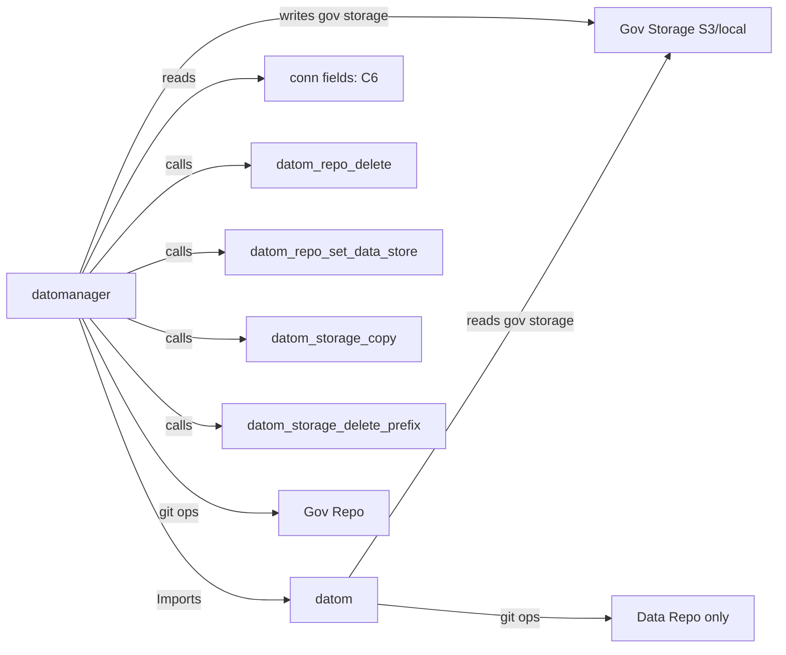
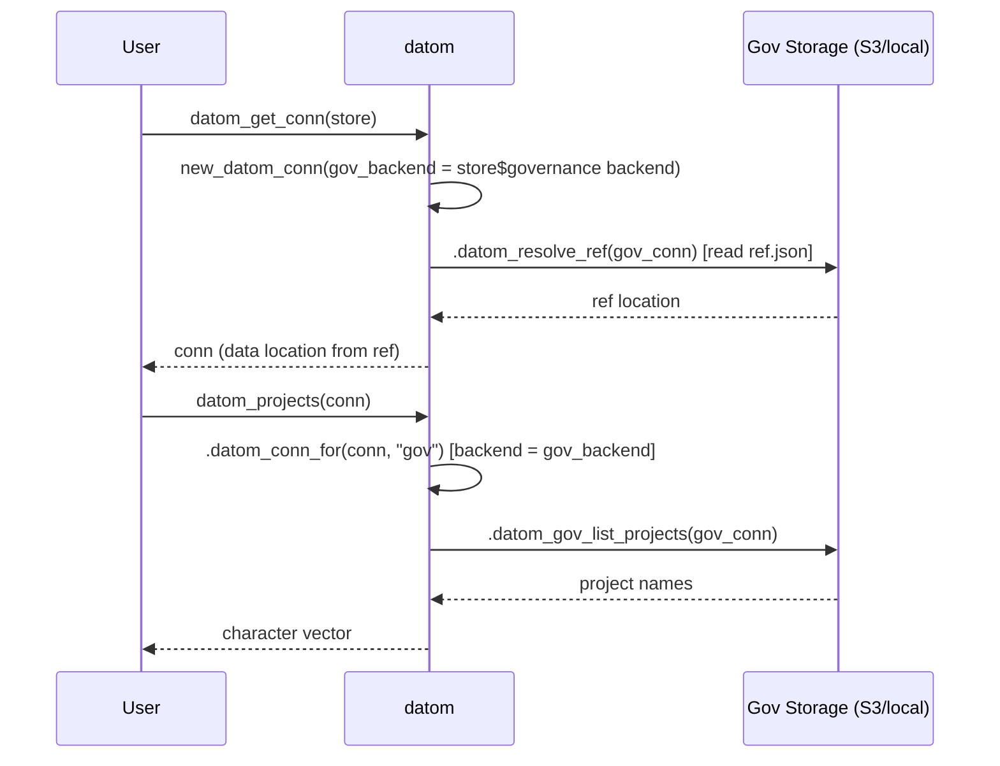

# Design Document: GOV_SEAM Lift-Out (datom side)

## Overview

This design covers the datom-side changes for the GOV_SEAM lift-out — a coordinated,
mostly-subtractive refactor that removes the governed write surface from datom and moves it
to datomanager. After the lift-out, datom retains all gov *reads* (ref resolution,
project listing, dispatch reads) and data-side teardown (`datom_repo_delete`), while
datomanager owns all gov *writes* (registration, dispatch/ref writes, git ops on the gov
repo).

datom lands first. Its changes are ordered so that:
1. The new interface (`gov_backend` field, corrected `.datom_conn_for`) is in place before
   datomanager goes live.
2. Removals cannot break datomanager because datomanager never imported the removed symbols.
3. datom remains fully functional (R CMD check clean, all retained tests pass) at every
   intermediate commit.

**Key principle (D2):** Pure separation — datomanager reaches into datom for nothing
gov-related. The only cross-package touchpoints are the conn fields (C6) and the data-side
`datom_repo_*` / `datom_storage_*` exports.

## Architecture

### Before (current state)

```
datom
├── R/conn.R        — new_datom_conn, .datom_conn_for (gov scope uses conn$backend)
├── R/conn.R        — datom_init_gov (exported), datom_attach_gov (exported)
├── R/conn.R        — datom_init_repo (gov registration branch)
├── R/decommission.R — datom_decommission (exported)
├── R/sync.R        — datom_sync_dispatch (exported), datom_pull_gov (exported)
├── R/utils-gov.R   — 6 read helpers + 9 write helpers
├── R/ref.R         — ref resolution (read-only)
├── R/repo.R        — datom_repo_delete, datom_repo_set_data_store
└── R/projects.R    — datom_projects (exported, read-only)
```

### After (target state)

```
datom
├── R/conn.R        — new_datom_conn (+gov_backend field)
│                     .datom_conn_for (gov scope uses conn$gov_backend)
│                     datom_init_repo (data-only, deprecation warning if gov arg supplied)
├── R/utils-gov.R   — 6 read helpers ONLY (write section removed)
├── R/ref.R         — ref resolution (unchanged)
├── R/repo.R        — datom_repo_delete, datom_repo_set_data_store (unchanged)
├── R/projects.R    — datom_projects (unchanged)
├── R/sync.R        — datom_pull (retained), datom_sync_manifest, datom_sync (retained)
│                     [datom_sync_dispatch REMOVED, datom_pull_gov REMOVED]
└── [REMOVED]       — R/decommission.R (entire file)
```

### Dependency flow after lift-out



## Components and Interfaces

### Component 1: `new_datom_conn` — add `gov_backend` field (R7, C6, D3)

**Current state:** `new_datom_conn` has no `gov_backend` parameter. The governance backend
is inferred by `.datom_build_gov_resolve_conn()` from the store component at conn-build
time, but the conn object itself does not carry a `gov_backend` field.

**Change:** Add `gov_backend` as a named parameter (default `NULL`) to `new_datom_conn`.
Include it in the `structure()` list. Populate it from the governance store component
backend during `datom_get_conn()`.

The twelve Conn_Interface_Contract fields on every conn will be:
`gov_local_path`, `gov_root`, `gov_prefix`, `gov_region`, `gov_backend`, `gov_client`,
`github_pat`, `project_name`, `backend`, `root`, `prefix`, `region`.

Solo projects: gov fields are NULL (including `gov_backend`).

### Component 2: `.datom_conn_for(conn, "gov")` — use `gov_backend` (D3, C6)

**Current state:** `.datom_conn_for(conn, "gov")` copies `conn$backend` (the *data*
backend) into the gov sub-conn's `backend` field. This is the inconsistency that D3
resolves — gov storage operations currently use the data backend type to decide whether to
call S3 or local IO.

**Change:** When `scope == "gov"`, set `backend = conn$gov_backend` (not `conn$backend`).
This means a project with data on S3 and governance on local (or vice versa) will resolve
storage dispatch correctly for each scope.

```r
.datom_conn_for <- function(conn, scope = c("data", "gov")) {
  scope <- match.arg(scope)
  if (scope == "data") return(conn)

  structure(
    list(
      project_name = conn$project_name,
      backend      = conn$gov_backend,
      root         = conn$gov_root,
      prefix       = conn$gov_prefix,
      region       = conn$gov_region,
      client       = conn$gov_client,
      path         = conn$path,
      role         = conn$role,
      endpoint     = conn$endpoint
    ),
    class = "datom_conn"
  )
}
```

### Component 3: Decouple `datom_init_repo()` from gov registration (R4)

**Current state:** `datom_init_repo()` calls `.datom_gov_register_project()` when
`store$governance` is non-NULL and `gov_local_path` is available.

**Change:**
1. Remove the entire "Register project in gov repo" block at the end of `datom_init_repo()`.
2. Remove the gov namespace collision check (the check that aborts if the project is
   already registered in the gov clone).
3. Remove the `.gov_clone_created_here` on-exit cleanup (no gov clone interaction).
4. Keep the `has_gov` flag only for writing `governance.json` to the data clone (that still
   happens — it's data-side metadata).
5. If `store$governance` is non-NULL, ignore it silently for the purposes of registration
   (no warning, no error — the package is pre-release with zero users). The project
   initializes as a Solo_Project; governance attaches via `gov_attach()`.

### Component 4: Remove five exported gov functions (R2)

| Function | File | Action |
|----------|------|--------|
| `datom_init_gov()` | R/conn.R | Delete definition + roxygen |
| `datom_attach_gov()` | R/conn.R | Delete definition + roxygen |
| `datom_decommission()` | R/decommission.R | Delete entire file |
| `datom_sync_dispatch()` | R/sync.R | Delete definition + roxygen |
| `datom_pull_gov()` | R/sync.R | Delete definition + roxygen |

After deletion, `devtools::document()` regenerates NAMESPACE (five `export()` entries
disappear) and the five `man/*.Rd` files are deleted.

### Component 5: Remove nine GOV_SEAM write helpers (R1)

All are in `R/utils-gov.R` below the `# --- GOV_SEAM: write helpers ---` section marker:

1. `.datom_gov_commit()`
2. `.datom_gov_push()`
3. `.datom_gov_pull()` — the internal write-side pull (NOT `datom_pull()`'s data-side pull)
4. `.datom_gov_write_dispatch()`
5. `.datom_gov_write_ref()`
6. `.datom_gov_register_project()`
7. `.datom_gov_unregister_project()`
8. `.datom_gov_record_migration()`
9. `.datom_gov_destroy()`

After removal, `R/utils-gov.R` retains only:
- `.datom_gov_clone_exists()`
- `.datom_gov_clone_open()`
- `.datom_gov_clone_init()`
- `.datom_gov_validate_remote()`
- `.datom_gov_list_projects()`
- `.datom_gov_project_path()`

### Component 6: Remove internal callers of write helpers (R1.3)

After removing the write helpers, internal callers must be updated:

| Caller | File | Action |
|--------|------|--------|
| `datom_init_repo()` gov registration block | R/conn.R | Already removed (Component 3) |
| `datom_sync_dispatch()` | R/sync.R | Already removed (Component 4) |
| `datom_decommission()` | R/decommission.R | Already removed (Component 4) |
| `datom_pull()` gov-pull branch | R/sync.R | Remove the `.datom_gov_pull(conn)` call in `datom_pull()` |

**`datom_pull()` change:** The function currently calls `.datom_gov_pull(conn)` when
`conn$gov_local_path` is set. After the lift-out, datom performs no gov-repo git (C7).
Remove this branch entirely. `datom_pull()` becomes data-repo-only. datomanager's
`gov_pull()` handles the gov clone refresh.

### Component 7: Confirm existing guards (R3, Phase 22)

`datom_repo_delete()` and `datom_repo_set_data_store()` in `R/repo.R` already satisfy R3:
- `confirm` interlock (exact project_name match)
- `force_gov_attached` guard (refuses governed projects unless force=TRUE)
- No interactive prompt in non-interactive sessions

No code changes needed. Confirm via test review that existing tests cover R3 acceptance
criteria.

### Component 8: `.datom_require_gov` message update

The guard helper `.datom_require_gov()` currently directs users to `datom_attach_gov()`.
After the lift-out, `datom_attach_gov` is removed from datom. Update the message to
reference `gov_attach()` (the datomanager function):

```r
cli::cli_abort(c(
    "{what} requires governance, but this project has no governance attached.",
    "i" = "Use {.fn gov_attach} (from datomanager) to enable governance."
))
```

### Component 9: NAMESPACE / man / R CMD check cleanup (R8)

1. Run `devtools::document()` to regenerate NAMESPACE (removes five exports).
2. Delete orphaned `man/` files for removed functions.
3. Run `R CMD check` — target 0 errors, 0 warnings, only the benign system-time note.
4. Version bump in DESCRIPTION (patch: `0.0.0.9001` or similar dev bump).

## Data Models

### `datom_conn` object (twelve Conn_Interface_Contract fields)

```r
structure(
  list(
    project_name   = "my-study",
    backend        = "s3",          # data backend
    root           = "data-bucket",
    prefix         = "my-study",
    region         = "us-east-1",
    client         = <paws S3>,
    path           = "/home/user/my-study",
    role           = "developer",
    endpoint       = NULL,
    gov_root       = "gov-bucket",
    gov_prefix     = "org-gov",
    gov_region     = "us-east-1",
    gov_backend    = "s3",          # NEW: governance backend (C6)
    gov_client     = <paws S3>,
    gov_local_path = "/home/user/.datom/org-gov",
    data_repo_url  = "https://github.com/org/my-study.git",
    github_pat     = "ghp_***",
    github_api_url = "https://api.github.com"
  ),
  class = "datom_conn"
)
```

The twelve C6-contracted fields (bold = new):
`gov_local_path`, `gov_root`, `gov_prefix`, `gov_region`, **`gov_backend`**, `gov_client`,
`github_pat`, `project_name`, `backend`, `root`, `prefix`, `region`.

### Data flow: how gov reads still work after removals



**Key invariant:** After the lift-out, every gov-scoped read in datom routes through
`.datom_conn_for(conn, "gov")`, which now correctly sets `backend = conn$gov_backend`.
This means a mixed-backend configuration (e.g., data on S3, gov on local) resolves
storage dispatch to the correct backend for each scope.

## Correctness Properties

*A property is a characteristic or behavior that should hold true across all valid
executions of a system — essentially, a formal statement about what the system should do.
Properties serve as the bridge between human-readable specifications and machine-verifiable
correctness guarantees.*

### Property 1: Confirm guard on datom_repo_delete

*For any* project name and *for any* `confirm` value that is not byte-for-byte equal to
that project name (including NULL, NA, wrong type, empty string, whitespace variants),
`datom_repo_delete()` SHALL abort with an error before performing any deletion.
Conversely, *for any* matching confirm value, the guard passes.

**Validates: Requirements 3.2, 3.3**

### Property 2: Governance guard on datom_repo_delete

*For any* `datom_conn` where `gov_root` is non-NULL (governed project) and
`force_gov_attached` is FALSE, `datom_repo_delete()` SHALL abort with an error.
*For any* `datom_conn` where `gov_root` is NULL (solo project), the governance guard
SHALL pass regardless of `force_gov_attached`.

**Validates: Requirements 3.4, 3.5**

### Property 3: Gov state read round-trip (C8 conformance)

*For any* valid `ref.json` structure conforming to the C8 schema (object with `current`
containing `type`, `root`, `prefix`, `region` and `previous` as array), serializing to
UTF-8 JSON with scalars unboxed then parsing via `.datom_parse_ref()` SHALL return a
location list where `root` equals `current.root`, `prefix` equals the normalized
`current.prefix`, and `region` defaults to `"us-east-1"` when absent.

**Validates: Requirements 5.4**

### Property 4: Twelve conn fields present on all conns

*For any* valid store configuration (solo or governed, S3 or local, with or without
governance component), the `datom_conn` object produced by `new_datom_conn()` SHALL
contain all twelve Conn_Interface_Contract fields as named list elements (gov-scoped fields
MAY be NULL on solo projects but MUST be present as named entries).

**Validates: Requirements 7.1**

### Property 5: Gov-scoped backend resolution

*For any* `datom_conn` with `gov_backend` set to a value `B` (either `"s3"` or
`"local"`), `.datom_conn_for(conn, "gov")$backend` SHALL equal `B`, independent of
`conn$backend`.

**Validates: Requirements 7.3, 7.4**

## Error Handling

### Removed function calls

If any downstream code calls a removed export (`datom_init_gov`, `datom_attach_gov`,
`datom_decommission`, `datom_sync_dispatch`, `datom_pull_gov`), R will produce the
standard `could not find function` error. No deprecation shim or soft-deprecation is
provided — the package is pre-release with zero users.

### Deprecation warning on datom_init_repo with governance

Removed — not applicable. The package is pre-release with zero users. When
`store$governance` is non-NULL, `datom_init_repo()` simply ignores it for registration
purposes (the governance.json data-side metadata file is still written if appropriate).

### Gov-read failures without datomanager

When a gov-read function (e.g., `datom_projects()`) is called on a conn with governance
fields but the gov clone does not exist or storage is unreachable, the existing error
handling remains unchanged:
- `.datom_require_gov()` aborts if `gov_root` is NULL.
- `.datom_resolve_ref()` wraps read failures with an actionable message.
- `.datom_gov_list_projects()` aborts with connectivity details.

None of these mention datomanager by name (C1 compliance).

### .datom_conn_for with NULL gov_backend

If `conn$gov_backend` is NULL (solo project) and a caller invokes
`.datom_conn_for(conn, "gov")`, the returned sub-conn has `backend = NULL`. The storage
dispatch layer (`.datom_storage_*`) will fail with a clear error on the first IO attempt.
This is the correct behavior — gov-only commands gate on `.datom_require_gov()` before
reaching `.datom_conn_for`.

## Testing Strategy

### Approach: unit tests + property-style tests + R CMD check

- **Property-style tests** (plain testthat): verify the five correctness properties by
  looping a crafted battery of inputs over each property's input space (no external
  property-testing dependency). The input spaces here are small and well-understood (guard
  values, field presence, a JSON round-trip), so an enumerated battery covers them.
- **Unit tests** (testthat): specific examples, edge cases, structural smoke checks.
- **R CMD check**: integration gate — 0 errors, 0 warnings.

### Property-style testing approach

No external property-testing library is used (`hedgehog` was considered and dropped to keep
the dependency surface lean — consistent with "simplicity over cleverness"). Each property
is exercised by iterating an explicit battery of representative + adversarial inputs with
`purrr::walk()` / `testthat::expect_*`, asserting the property holds for every case.

### Property test tagging

Each property-style test includes a comment referencing the design property:
```r
# Feature: gov-seam-liftout, Property 5: Gov-scoped backend resolution
```

### Unit test plan (by component)

| Test scope | File | Coverage |
|------------|------|----------|
| `new_datom_conn` + gov_backend | test-conn.R | Field presence, NULL on solo |
| `.datom_conn_for` gov backend | test-conn.R | Backend swap, mixed configs |
| `datom_init_repo` decoupled | test-conn.R | No gov-write calls, deprecation warning |
| Removed exports absent | test-namespace.R (new) | NAMESPACE / man absence checks |
| `datom_repo_delete` guards | test-repo.R | confirm, gov guard, edge cases |
| Gov read surface retained | test-projects.R, test-ref.R | Existing tests kept |
| `datom_pull()` data-only | test-sync.R | No gov-pull branch |

### Tests to remove

- All tests in `test-utils-gov.R` that exercise the nine write helpers.
- Tests in `test-conn.R` exercising `datom_init_gov()` and `datom_attach_gov()`.
- Tests in `test-decommission.R` (entire file, if it exists).
- Tests in `test-sync.R` for `datom_sync_dispatch()` and `datom_pull_gov()`.
- Tests in `test-conn.R` exercising the gov-registration branch of `datom_init_repo()`.

### Tests to retain

- `test-utils-gov.R`: tests for the six read helpers.
- `test-ref.R`: all ref resolution tests.
- `test-repo.R`: `datom_repo_delete` and `datom_repo_set_data_store` tests.
- `test-projects.R`: `datom_projects()` tests.
- `test-conn.R`: `datom_get_conn`, `new_datom_conn`, `.datom_conn_for` tests.
- `test-sync.R`: `datom_pull`, `datom_sync_manifest`, `datom_sync` tests.

## Ordering of Changes Within datom's Branch

The commits are ordered so each intermediate state passes R CMD check:

1. **Add `gov_backend` field + fix `.datom_conn_for`** (additive, no breakage)
   - Add `gov_backend` param to `new_datom_conn`
   - Add `gov_backend` to `datom_get_conn` population logic
   - Fix `.datom_conn_for(conn, "gov")` to use `conn$gov_backend`
   - Update existing `.datom_conn_for` tests
   - R CMD check: passes (additive only)

2. **Decouple `datom_init_repo()` from gov registration** (behavioral change)
   - Remove gov-registration block from `datom_init_repo()`
   - Remove gov-clone on-exit cleanup
   - Add deprecation warning when `store$governance` is non-NULL
   - Remove/update tests for the init+register path
   - R CMD check: passes

3. **Remove `datom_pull_gov()` + `datom_sync_dispatch()` + gov-pull from `datom_pull()`**
   - Delete `datom_pull_gov()` and `datom_sync_dispatch()` from sync.R
   - Remove `.datom_gov_pull(conn)` call from `datom_pull()`
   - Delete corresponding tests
   - R CMD check: passes (exports removed, no callers remain)

4. **Remove `datom_decommission()`**
   - Delete `R/decommission.R`
   - Delete corresponding tests
   - R CMD check: passes

5. **Remove `datom_init_gov()` + `datom_attach_gov()`**
   - Delete both from `R/conn.R`
   - Delete corresponding tests
   - Update `.datom_require_gov()` message
   - R CMD check: passes

6. **Remove nine GOV_SEAM write helpers**
   - Delete everything below the write-helper section marker in `R/utils-gov.R`
   - Delete write-helper tests from `test-utils-gov.R`
   - R CMD check: passes (no internal callers remain after steps 2–5)

7. **NAMESPACE / man cleanup + version bump**
   - `devtools::document()` → regenerate NAMESPACE, delete orphan .Rd files
   - Version bump in DESCRIPTION
   - Final R CMD check: 0 errors, 0 warnings

