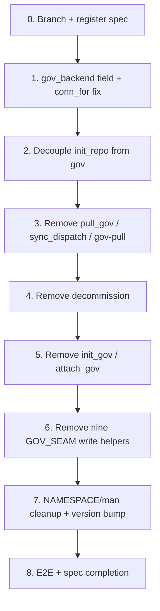

# Implementation Plan: GOV_SEAM Lift-Out (datom side)

## Overview

Tasks derive from the design's 7-step commit ordering (design.md → "Ordering of Changes
Within datom's Branch"). Each numbered task group is one commit; every intermediate state
passes `R CMD check`. Run the full `devtools::test()` suite before every commit and report
the count.

The lift-out is mostly subtractive. datom lands first (it must expose the new interface
before datomanager goes live); its removals cannot break datomanager, which never imported
the removed gov surface.

## Task Dependency Graph



The lift-out is a strictly sequential chain — each task group is one commit that must keep
`R CMD check` green, and later removals depend on earlier caller removals. Each wave is a
single task.

```json
{
  "waves": [
    { "wave": 1, "tasks": ["0"] },
    { "wave": 2, "tasks": ["1"] },
    { "wave": 3, "tasks": ["2"] },
    { "wave": 4, "tasks": ["3"] },
    { "wave": 5, "tasks": ["4"] },
    { "wave": 6, "tasks": ["5"] },
    { "wave": 7, "tasks": ["6"] },
    { "wave": 8, "tasks": ["7"] },
    { "wave": 9, "tasks": ["8"] }
  ]
}
```

## Tasks

- [x] 0. Create branch and register spec as active
  - Create `spec/gov-seam-liftout` from `main`
  - Add a row to the `dev/README.md` Active Specs table (status: tasks started)
  - Confirm baseline: run `devtools::test()`, record the starting count (1897, FAIL 0)
  - _Requirements: all (setup)_

- [ ] 1. Add `gov_backend` field and fix `.datom_conn_for` (additive, no breakage)
  - [ ] 1.1 Add `gov_backend` parameter to `new_datom_conn()` in `R/conn.R`
    - New named param `gov_backend = NULL`; include it in the `structure()` list between
      `gov_region` and `gov_client`
    - Add the roxygen `@param gov_backend` entry
    - _Requirements: 7.1, 7.2, 7.3; contract C6_
  - [ ] 1.2 Populate `gov_backend` from the governance store component in `datom_get_conn()`
    - Source it from the gov store backend (mirror how `.datom_build_gov_resolve_conn()`
      derives the gov backend today); pass it through `.datom_build_init_conn()` /
      `new_datom_conn()` call sites
    - Solo projects: `gov_backend` is NULL alongside the other gov fields
    - _Requirements: 7.1, 7.3; contract C6_
  - [ ] 1.3 Fix `.datom_conn_for(conn, "gov")` to use `conn$gov_backend`
    - Change `backend = conn$backend` → `backend = conn$gov_backend` in the gov branch
    - Update the inline comment that references `datom_sync_dispatch` / `datom_pull_gov`
      (those are being removed) to a backend-neutral note
    - _Requirements: 7.4; contract C6, D3_
  - [ ] 1.4 Tests for the new field and backend resolution
    - Unit (test-conn.R): twelve C6 fields present on every conn (solo + governed, S3 +
      local); `gov_backend` NULL on solo
    - Property 4 (twelve conn fields present on all conns) — `hedgehog::forall`, ≥100 cases
    - Property 5 (gov-scoped backend resolution: `.datom_conn_for(conn,"gov")$backend == B`
      independent of `conn$backend`) — `hedgehog::forall`, ≥100 cases
    - Add `hedgehog` to `Suggests` in DESCRIPTION (not yet a dependency)
    - _Requirements: 7.1, 7.3, 7.4_
  - [ ] 1.5 `R CMD check` (additive only — expect clean), full test suite, commit

- [ ] 2. Decouple `datom_init_repo()` from gov registration
  - [ ] 2.1 Remove gov interaction from `datom_init_repo()` in `R/conn.R`
    - Remove the "Register project in gov repo" block (`.datom_gov_register_project` call)
    - Remove the gov namespace collision check (the `gov_project_dir` already-registered abort)
    - Remove the gov-clone `Step 0` init (`.datom_gov_clone_init`) and the
      `.gov_clone_created_here` on-exit rollback
    - Keep the `has_gov` flag and `governance.json` data-side write (data-side metadata stays)
    - If `store$governance` is non-NULL, ignore it silently for registration (pre-release,
      zero users — no warning, no error). Project initializes as a Solo_Project.
    - Stop building `dispatch`/`ref` payloads here (they were only for gov registration)
    - _Requirements: 4.1, 4.2, 4.3, 4.4_
  - [ ] 2.2 Update / remove tests for the init+register path in test-conn.R
    - Remove assertions that `datom_init_repo()` registers in gov
    - Add: after init with a gov store arg, project is a Solo_Project (project.yaml is
      location authority, no gov registration occurred)
    - _Requirements: 4.3, 4.4; 9.2_
  - [ ] 2.3 `R CMD check`, full test suite, commit

- [ ] 3. Remove `datom_pull_gov()`, `datom_sync_dispatch()`, and gov-pull from `datom_pull()`
  - [ ] 3.1 Delete `datom_pull_gov()` and `datom_sync_dispatch()` from `R/sync.R` (defs + roxygen)
    - _Requirements: 2.4, 2.5_
  - [ ] 3.2 Remove the `.datom_gov_pull(conn)` branch from `datom_pull()` in `R/sync.R`
    - `datom_pull()` becomes data-repo-only; datomanager's `gov_pull()` owns gov clone refresh
    - _Requirements: 10.1, 10.2; contract C7, D1_
  - [ ] 3.3 Delete corresponding tests in test-sync.R (`datom_sync_dispatch`, `datom_pull_gov`,
        and the gov-pull branch of `datom_pull`); retain `datom_pull` data-only,
        `datom_sync_manifest`, `datom_sync` tests
    - _Requirements: 9.1, 9.3_
  - [ ] 3.4 `R CMD check` (exports removed, no callers remain), full test suite, commit

- [ ] 4. Remove `datom_decommission()`
  - [ ] 4.1 Delete `R/decommission.R` entirely
    - _Requirements: 2.3_
  - [ ] 4.2 Delete `tests/testthat/test-decommission.R`
    - _Requirements: 9.1, 9.2_
  - [ ] 4.3 Confirm no remaining references to `datom_decommission` in `R/` or `tests/`
    - _Requirements: 1.3, 2.3_
  - [ ] 4.4 `R CMD check`, full test suite, commit

- [ ] 5. Remove `datom_init_gov()` + `datom_attach_gov()`; update guard message
  - [ ] 5.1 Delete `datom_init_gov()` and `datom_attach_gov()` from `R/conn.R` (defs + roxygen)
    - _Requirements: 2.1, 2.2_
  - [ ] 5.2 Update `.datom_require_gov()` message to point to `gov_attach()` (datomanager)
    - Replace `{.fn datom_attach_gov}` reference with `{.fn gov_attach}` and "(from datomanager)"
    - Message must not reference datomanager in a way that errors/warns at load (prose only)
    - _Requirements: 6.1, 6.3; contract C1, Component 8_
  - [ ] 5.3 Delete tests exercising `datom_init_gov()` / `datom_attach_gov()` in test-conn.R
    - _Requirements: 9.1_
  - [ ] 5.4 `R CMD check`, full test suite, commit

- [ ] 6. Remove the nine GOV_SEAM write helpers
  - [ ] 6.1 Delete everything below `# --- GOV_SEAM: write helpers ---` in `R/utils-gov.R`
    - The nine: `.datom_gov_commit`, `.datom_gov_push`, `.datom_gov_pull`,
      `.datom_gov_write_dispatch`, `.datom_gov_write_ref`, `.datom_gov_register_project`,
      `.datom_gov_unregister_project`, `.datom_gov_record_migration`, `.datom_gov_destroy`
    - Retain the six read helpers (`.datom_gov_clone_exists`, `_clone_open`, `_clone_init`,
      `_validate_remote`, `_list_projects`) and `.datom_gov_project_path` (used by reads)
    - Confirm no retained read helper references a deleted write helper
    - _Requirements: 1.1, 1.2, 10.3_
  - [ ] 6.2 Confirm no internal caller in `R/` references a removed write helper by name
    - grep `R/` for each of the nine names — expect zero hits after steps 2–5
    - _Requirements: 1.3_
  - [ ] 6.3 Delete write-helper tests from test-utils-gov.R; retain read-helper tests
    - _Requirements: 9.1, 9.3_
  - [ ] 6.4 `R CMD check`, full test suite, commit

- [ ] 7. NAMESPACE / man cleanup, retained-surface tests, version bump
  - [ ] 7.1 `devtools::document()` — regenerate NAMESPACE (five `export()` entries gone),
        delete orphaned `man/*.Rd` for the five removed functions
    - _Requirements: 2.6, 8.3_
  - [ ] 7.2 Add `test-namespace.R` — assert removed exports are absent from the namespace and
        retained gov-read exports (`datom_projects`, `datom_pull`, `datom_repo_delete`) present
    - _Requirements: 2.6, 5.1, 9.3_
  - [ ] 7.3 Confirm retained surface tests pass and `datom_repo_delete` guards are covered
    - Property 1 (confirm guard) and Property 2 (governance guard) on `datom_repo_delete` —
      `hedgehog::forall`, ≥100 cases (test-repo.R); add if not already present
    - Property 3 (gov state read round-trip / C8) on the ref parser — `hedgehog::forall`,
      ≥100 cases (test-ref.R)
    - _Requirements: 3.2, 3.3, 3.4, 3.5, 5.3, 5.4, 9.3_
  - [ ] 7.4 Version bump in DESCRIPTION (dev patch bump)
    - _Requirements: 8.1_
  - [ ] 7.5 Final `R CMD check`: 0 errors, 0 warnings, only the benign system-time note;
        full test suite, commit
    - _Requirements: 8.1, 8.2, 8.3_

- [ ] 8. E2E validation and spec completion
  - [ ] 8.1 Run a real end-to-end solo-project workflow via `dev/dev-sandbox.R`
        (init → write → read → `datom_repo_delete`) to confirm datom is fully functional
        without datomanager
    - _Requirements: 6.1, 6.2_
  - [ ] 8.2 Harvest durable learnings (API/design → `dev/datom_specification.md`; gotchas →
        `dev/engineering-notes.md`; pathway impact → `dev/datom_pathways.md` or record
        "no pathway impact")
  - [ ] 8.3 Update `dev/README.md`: move spec to Completed, record final test count
  - [ ] 8.4 PR to `main`, merge, delete branch (spec persists — do NOT delete it)

## Notes

- **Commit cadence**: one numbered task group = one commit. Report the full
  `devtools::test()` count in every commit message; if it drops unexpectedly, something was
  lost beyond the intentionally-removed tests.
- **Ordering is load-bearing**: write helpers (task 6) are removed only after all their
  internal callers are gone (tasks 2–5), so each intermediate commit keeps `R CMD check`
  green.
- **Property tests**: `hedgehog` is added to `Suggests` in task 1.4. Each property test
  carries a comment `# Feature: gov-seam-liftout, Property N: ...` and runs ≥100 cases.
- **Chunk checkpoint**: stop after each committed task group and wait for explicit go-ahead
  before starting the next (per copilot-instructions rule 5d).
- **No pathway impact expected**: this is a code-organization lift-out; gov read/write
  routes are unchanged in shape. Confirm and record "no pathway impact" at task 8.2.
