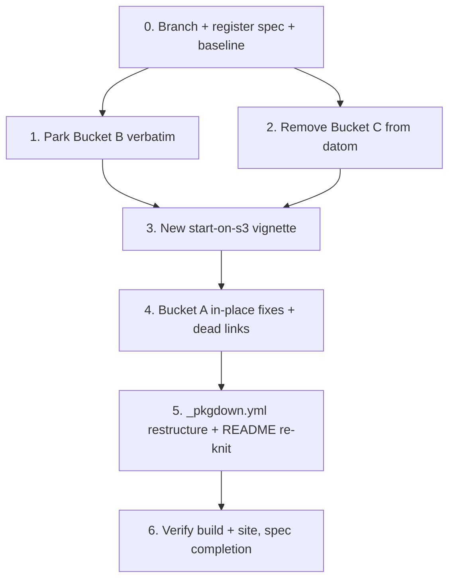

# Implementation Plan: Vignettes post GOV_SEAM lift-out (datom side)

> **Execute with GitHub Copilot.** Documentation-only phase — no `R/` or `NAMESPACE` changes
> (Property 1). Read `requirements.md` and `design.md` first. One task group = one commit; keep
> the build green at each step. Because nothing here changes code, "tests" means
> `R CMD build` + `pkgdown::build_site()` + the unchanged `devtools::test()` count.

## Overview

Six task groups, each one commit. Buckets are moved (B/C) or fixed in place (A), the new
S3 article is authored, `_pkgdown.yml` is restructured to a Bucket-A-only site, and the
build + site are verified. No code changes (Property 1).

## Task Dependency Graph



```json
{
  "waves": [
    { "wave": 1, "tasks": ["0"] },
    { "wave": 2, "tasks": ["1", "2"] },
    { "wave": 3, "tasks": ["3"] },
    { "wave": 4, "tasks": ["4"] },
    { "wave": 5, "tasks": ["5"] },
    { "wave": 6, "tasks": ["6"] }
  ]
}
```

## Tasks

- [ ] 0. Branch, register spec, baseline
  - Create `spec/vignettes-gov-liftout` from `main`.
  - Add a row to the `dev/README.md` Active Specs table (status: tasks started).
  - Record baseline: run `devtools::test()` and note the count; confirm `R CMD build` +
    `pkgdown::build_site()` currently succeed (they should, since `eval = FALSE`).
  - Confirm preservation precondition (Property 3): `datomanager/dev/vignettes-from-datom/`
    contains `governing-a-portfolio.Rmd`, `auditing-reproducibility.Rmd`, `NOTE.md`.
  - _Requirements: all (setup)_

- [ ] 1. Park Bucket B verbatim under `dev/vignettes-deferred/`
  - `git mv` each Bucket B vignette into `dev/vignettes-deferred/`:
    `promoting-to-s3.Rmd`, `handing-off.Rmd`, `second-engineer.Rmd`,
    `credentials-in-practice.Rmd`, `buckets-and-prefixes.Rmd`, `design-ref-json.Rmd`,
    `design-governance-json.Rmd`, `design-dispatch.Rmd`, `design-two-repos.Rmd`.
  - `git mv` `inst/vignette-setup/resume_article_4.R` .. `resume_article_8.R` into
    `dev/vignettes-deferred/vignette-setup/`. Leave `resume_article_2.R` and `_3.R` in place.
  - Write `dev/vignettes-deferred/README.md`: parking rationale, original `_pkgdown.yml`
    grouping per file, the user-journey ordering, and the "blocked on datomanager gov API"
    note.
  - Do NOT edit any moved file's content (Property 2).
  - _Requirements: 3.1, 3.2, 3.3, 3.4, 3.5_

- [ ] 2. Remove Bucket C copies from datom
  - Verify Property 3 precondition again, then `git rm vignettes/governing-a-portfolio.Rmd
    vignettes/auditing-reproducibility.Rmd`.
  - (Their `_pkgdown.yml` entries are removed in Task 5.)
  - _Requirements: 4.1, 4.2_

- [ ] 3. Author `vignettes/start-on-s3.Rmd` (new, gov-free S3 start)
  - Follow `design.md` Component 1. Confirm `datom_init_repo()` / `datom_store_s3()` /
    `datom_repo_delete()` signatures against `R/repo.R`, `R/store.R` before finalizing.
  - `governance = NULL`; no gov calls; no migration; teardown via `datom_repo_delete()`.
  - Add the forward-pointer to managed migration (companion package) so the deferred
    `promoting-to-s3.Rmd` arc can reattach later without contradiction.
  - ASCII only (Property 4). All chunks `eval = FALSE` to match the suite.
  - _Requirements: 2.1, 2.2, 2.3, 2.4_

- [ ] 4. Bucket A in-place fixes
  - [ ] 4.1 `first-extract.Rmd`: `datom_decommission()` -> `datom_repo_delete()`; repoint the
    two forward-links to the moved `promoting-to-s3` (soften to prose or point at
    `start-on-s3.html`).
  - [ ] 4.2 `source-lineage.Rmd`: setup store `gov = datom_store_s3(...)` -> `governance = NULL`.
  - [ ] 4.3 `looking-ahead.Rmd`: reword gov framing to companion-package terms.
  - [ ] 4.4 `design-datom-model.Rmd`, `design-serverless.Rmd`: reword conceptual gov mentions;
    verify neither calls a removed function.
  - [ ] 4.5 `month-2-arrives.Rmd`, `folder-of-extracts.Rmd`, `design-version-shas.Rmd`,
    `README.Rmd`: verify, fix any dead cross-links / gov mentions.
  - Sweep dead links (Property 5): no surviving article links to a moved article's `.html`.
  - _Requirements: 1.2, 1.3_

- [ ] 5. `_pkgdown.yml` articles restructure + README re-knit
  - Replace the `articles:` section with the Bucket-A-only grouping in `design.md`
    Component 5. Leave the `reference:` (function index) section untouched.
  - Re-knit README: `devtools::build_readme()`.
  - _Requirements: 1.1, 1.4, 4.3_

- [ ] 6. Verify and complete the spec
  - Run the seven checks in `design.md` -> "Testing Strategy". All must pass.
  - Confirm `git status` shows zero changes under `R/` and to `NAMESPACE` (Property 1).
  - Harvest learnings: note in `dev/engineering-notes.md` that the deferred suite lives in
    `dev/vignettes-deferred/` and the two gov articles moved to datomanager.
  - Update `dev/README.md` Active Specs (status: complete; specs persist, do not delete).
  - PR to `main`, merge, delete the branch.
  - _Requirements: 5.1, 5.2, 5.3, 5.4_

## Notes

- The datomanager-side preservation (Bucket C) is already done by Kiro; this spec only
  removes the datom copies. If `datomanager/dev/vignettes-from-datom/` is missing, STOP and
  restore it before Task 2.
- This is documentation-only. If any task appears to need an `R/` or `NAMESPACE` edit, that
  is a signal the task is mis-scoped — re-read `design.md` rather than editing code.
