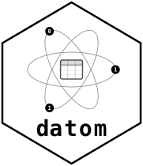

<!-- README.md is generated from README.Rmd. Please edit that file -->

```{r, include = FALSE}
knitr::opts_chunk$set(
  collapse  = TRUE,
  comment   = "#>",
  fig.path  = "man/figures/README-",
  out.width = "100%",
  eval      = FALSE
)
```

# datom 

<!-- badges: start -->
[](https://lifecycle.r-lib.org/articles/stages.html#experimental)
[](https://github.com/amashadihossein/datom/actions/workflows/R-CMD-check.yaml)
[](https://app.codecov.io/gh/amashadihossein/datom)
<!-- badges: end -->

## A right-sized foundation for versioned, traceable data

Analytical work depends on data that continues to change. A single project may
involve dozens or hundreds of tables, with further tables derived from them and
transformation logic that evolves alongside the analysis. Keeping this body of
data trackable and reproducible -- across revisions and across collaborators --
is a substantial, ongoing task, and one that ad-hoc collections of dated files
handle poorly.

A common response is to adopt a data platform: a warehouse, a lakehouse, or a
relational database. For datasets of this size, that is usually more machinery
than the problem warrants. Distributed compute, transactional guarantees, and a
running server carry real cost and operational overhead, and even then the
versioning and lineage that motivated the move often still require custom work.

**datom** provides that capability directly. It offers versioned,
content-addressed storage with deduplication, complete data lineage, and
reproducible access to any prior state, alongside a clear separation between
those who write data and those who read it. It is built on tools already
available to most data scientists -- git and optionally cloud object storage --
and requires no server, database, or platform to operate. In practice, you hand
datom a set of tables and receive a durable, versioned reference to them; datom
manages what sits beneath.

It is deliberately modest to adopt, and it does not constrain what follows: the
same setup serves a single analyst today and, with the governance layer, a
managed portfolio of projects later.

> *datom -- the atomic, immutable unit of your data.*

## Where datom fits, and where it does not

datom rests on a few assumptions about the work it supports. Where they hold, it
removes a considerable amount of unnecessary cost and complexity. Where they do
not, another tool is the better choice.

**Individual tables are modest in size** -- typically under a terabyte each,
though there is no hard limit and no constraint on how many tables you manage.
In aggregate the data can be large; datom simply assumes each table fits
comfortably in a single read. If you require transactional (ACID) guarantees or
high-throughput concurrent writes over very large individual tables, a database
or warehouse is the appropriate tool.

**Your computation fits in memory.** Most of the analysis runs comfortably on a
modern workstation. If your work depends on distributed, server-side aggregation
over big data, datom is not intended to replace that.

**You are not already getting this from an existing investment.** If a
combination of platform and custom tooling already delivers versioning, lineage,
and governed access at a cost you find acceptable, datom has little to add. Its
value is greatest when that capability is missing -- and when you would rather
not take on the recurring cost of compute, servers, and platform maintenance to
get it.

In short, datom aims to be what this kind of work needs, and not what it does
not.

## Clinical statistical programming and data management

datom's primary use case today is clinical data science -- the regulated,
audit-sensitive environment where statistical programmers and data managers
produce datasets that underpin regulatory submissions.

In a typical clinical trial, raw EDC extracts arrive in periodic cuts. Each cut
generates a new set of SDTM or ADaM tables. Derived datasets depend on earlier
ones, and the transformation logic evolves as the study matures. At lock, a
submission package must demonstrate exactly which data was present at each
milestone, which derivations produced it, and that no silent edits occurred
between cuts.

datom provides this out of the box:

- **Immutable, SHA-addressed versions** -- every data cut is a content-stamped
  snapshot. Reviewers and auditors can retrieve exactly what existed at any prior
  point.
- **Complete lineage** -- every derived table records which parent tables (and
  which versions of those parents) it descends from, traceable back to the raw
  source.
- **Reader/developer separation** -- statisticians who consume data operate in a
  read-only mode that requires no git access, no server, and no platform
  credentials beyond storage. Data managers who produce data operate through a
  git-backed write path with full audit trail.
- **No infrastructure to maintain** -- no database server, no scheduler, no
  platform team. The data sits in object storage (or a shared filesystem); the
  audit trail sits in git.

This supports the path from raw EDC extracts through to locked, auditable
analysis datasets -- with reproducibility, traceability, and governance built
into the data layer rather than bolted on after the fact.

## Capabilities

| Capability | Status |
|---|---|
| Immutable, content-addressed versioning | ✅ Supported |
| Exact historical reads by version SHA | ✅ Supported |
| Data lineage / provenance at every version | ✅ Supported |
| Reader/developer split (read-only from storage alone) | ✅ Supported |
| Backends: local filesystem + S3 | ✅ Supported |
| Serverless -- no server, database, or daemon | ✅ Supported |
| Governed backend migration (local ↔ S3) | 🧩 Planned -- datom ships the storage API; companion package pending |
| Access control | 🧩 Planned -- hooks exist; companion package pending |
| Cross-language read/write (Python, CLI) | 🔭 On the roadmap -- open Parquet + git makes this feasible |
| Metadata diffs and built-in data contracts | 🔭 On the roadmap |

## Installation

Install the released version from CRAN:

```r
install.packages("datom")
```

Or install the development version from GitHub:

```r
# install.packages("pak")
pak::pak("amashadihossein/datom")
```

## A two-minute tour

> **What this tour builds:** a shared, versioned data space with reproducible
> reads for multiple engineers and analysts -- coordinated through a single git
> history. Every `datom_write()` is a commit; every `datom_read()` resolves
> to an exact content SHA. No one can silently overwrite history.

**Before you start:** you need a GitHub personal access token (PAT) scoped to
`repo`. While you don't need to have this token stored in your OS keychain, use of
`keyring` is recommended for security and ease of use.

```r
keyring::key_set("GITHUB_PAT")          # one-time setup
nzchar(keyring::key_get("GITHUB_PAT"))  # verify -- should return TRUE
```

Using `keyring` keeps the PAT out of your code and command history; see the
`keyring` package documentation for setup details.

```r
library(datom)
library(fs)

# Two paths, two roles:
#   dev_dir  -- your local workspace for this project (stays on your machine)
#   data_dir -- where the actual data lives; point this at a shared location
#               (network drive, S3, etc.) for team access. Temp dir used here
#               for demonstration -- replace with a real path when you're ready.
dev_dir  <- path(tempdir(), "study_001_dev")
data_dir <- path(tempdir(), "study_001_data")
dir_create(data_dir)

# Build a store (the only credential needed is your GitHub PAT).
data_component <- datom_store_local(path = data_dir)

store <- datom_store(
  governance = NULL,
  data       = data_component,
  github_pat = keyring::key_get("GITHUB_PAT")
)

# Initialize a project: registers it on GitHub and sets up your dev workspace.
datom_init_repo(
  path         = dev_dir,
  project_name = "STUDY_001",
  store        = store,
  create_repo  = TRUE,
  repo_name    = "study-001-data"
)

conn <- datom_get_conn(path = dev_dir, store = store)

# Explore what was created before writing anything.
fs::dir_tree(dev_dir)   # your local workspace
fs::dir_tree(data_dir)  # data storage (empty until first write)
```

Now write a table -- twice -- and watch datom do the right thing:

```r
dm <- datom_example_data("dm", cutoff_date = "2026-01-28")

datom_write(conn, data = dm, name = "dm", message = "Initial DM extract")
#> v Wrote "dm" (full): "a8ee7a31"

# Same data again. datom recognizes it and skips.
datom_write(conn, data = dm, name = "dm")
#> i No changes detected for "dm". Skipping write.

datom_list(conn)
#>   name current_version current_data_sha last_updated
#> 1   dm         a8ee7a31         4b6d0a7e 2026-01-28T...

# datom reads back data as a tibble. Use tibble::as_tibble() on the
# original for a clean round-trip comparison.
identical(datom_read(conn, "dm"), tibble::as_tibble(dm))
#> [1] TRUE
```

Three things just happened that are worth pausing on:

1. **Reproducibility is now built in** -- every write minted a SHA tied to
   the data itself. That SHA is how you read back, list, diff, and audit.
   Same data on any machine returns the same SHA; same SHA always returns
   the same bytes. `datom_read()`, `datom_list()`, and `datom_history()` are
   all just different views into the same versioned record.
2. **Idempotent writes** -- re-writing the same data was a free no-op.
   Pipelines are safe to re-run without polluting history.
3. **Data as code** -- the version history is in git: diffable, reviewable,
   and shareable like any other code asset. The data bytes stayed in
   `data_dir` -- nothing sensitive went to GitHub. Before you tear down,
   open `https://github.com/<your-username>/study-001-data` and look at
   the commits: you will see the full audit trail with no data bytes in sight.

## Teardown

Pick one:

```r
# Option A -- full scripted teardown (deletes local files AND the GitHub repo).
# Do this BEFORE unlink().
datom_repo_delete(conn, confirm = "STUDY_001")

# Option B -- local only (GitHub repo stays; delete it manually from the UI).
unlink(c(dev_dir, data_dir), recursive = TRUE)
```

Do not call `unlink()` before `datom_repo_delete()` -- removing the local
clone first strips the GitHub remote reference and the remote repo will not
be deleted.

## Where to go next

The [Get Started](https://amashadihossein.github.io/datom/articles/) article
walks through a complete sync-based workflow -- from a single file to a batch
of extracts -- on a local filesystem, then the S3 article mirrors it in object
storage.

| When you are ready for | Article |
|---|---|
| The same workflow directly in S3 object storage | [Starting on S3](https://amashadihossein.github.io/datom/articles/start-on-s3.html) |
| Tracing how derived tables descend from raw | [Tracing Data Lineage](https://amashadihossein.github.io/datom/articles/source-lineage.html) |

For the design rationale -- why two repos, what `ref.json` does, how SHAs are
computed -- see the **Design** articles in the same site, or
`dev/datom_specification.md` for the full technical specification.
